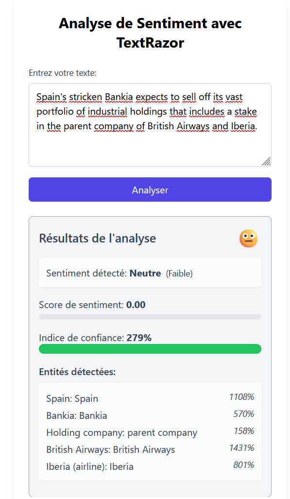

# 🧠 Analyse de Sentiment avec TextRazor

Ce projet est une petite application React permettant d’analyser le **sentiment** d’un texte en utilisant l’API **TextRazor**.

---

## ⚙️ Fonctionnalités

- Analyse de sentiment (positif, négatif, neutre)
- Extraction des entités présentes dans le texte
- Affichage du score et du taux de confiance

⚠️ Important : Autoriser le proxy CORS Anywhere

Pour que l’application fonctionne correctement, elle utilise le service CORS Anywhere afin de contourner les restrictions de sécurité liées aux requêtes cross-origin.

Étapes à suivre :

    Accéder au site de CORS Anywhere :

    👉 https://cors-anywhere.herokuapp.com/corsdemo

    Demander un accès temporaire :

    Sur la page, cliquez sur le bouton "Request temporary access to the demo server".

    Laisser l’onglet ouvert :

    Après avoir cliqué, ne fermez pas l’onglet. Laissez-le ouvert en arrière-plan pendant que vous utilisez l’application.

Note : Sans cette activation, les requêtes vers l'API TextRazor seront bloquées, entraînant des erreurs lors de l'analyse.
---

## 🚀 Démarrage rapide

1. Clonez ce dépôt :
   ```bash
   git clone hhttps://github.com/aldo990/sentiment_analyzer
   cd sentiment_analyzer
   
## 🖼️ Aperçu de l'application



## Membre du groupe

AKOWAKOU AMOUR
SANVI MOREL
KPANOU ALDO
